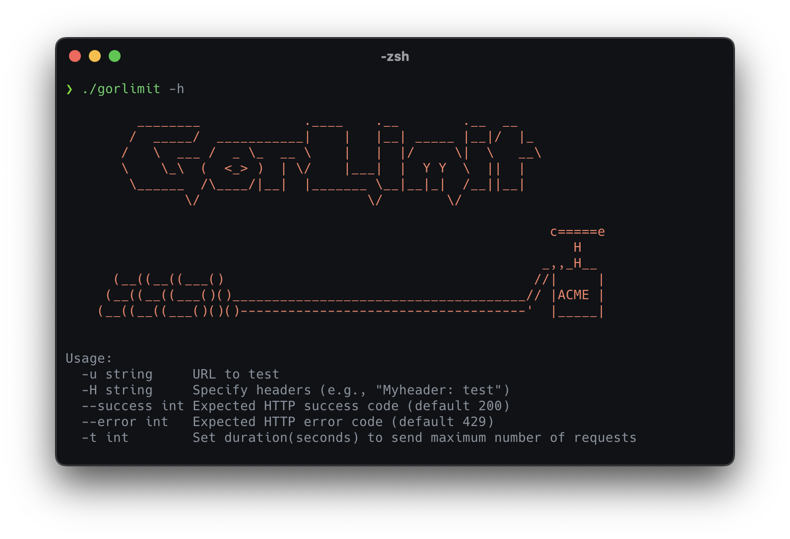

# gorlimit

This is a simple command-line tool written in Go that sends HTTP requests to a specified URL and checks the response codes. Its goal is to test web applications and servers for a rate limit implementation. It's useful for evaluating how well your server handles requests and responses under different rate limit scenarios.

## Features



- Send HTTP requests to a specified URL
- Specify custom HTTP headers
- Set expected HTTP success and error codes
- Set the duration to send requests

## Usage
Example usage:

```bash
go run main.go -u http://example.com -H "Authorization: Bearer YOUR_TOKEN_HERE" --success 200 --error 429 -t 60
```

This will send HTTP requests to http://example.com for 60 seconds, expecting a success code of 200 and an error code of 429.

## Installation
To install this tool, you need to have Go installed on your machine. Then, you can clone this repository and run the tool with go run main.go.

## Build
To build the tool, you can run the following command:
```bash
go build -o gorlimit main.go
```

## Contributing
Contributions are welcome! Please feel free to submit a pull request.

## License
This project is licensed under the MIT License.